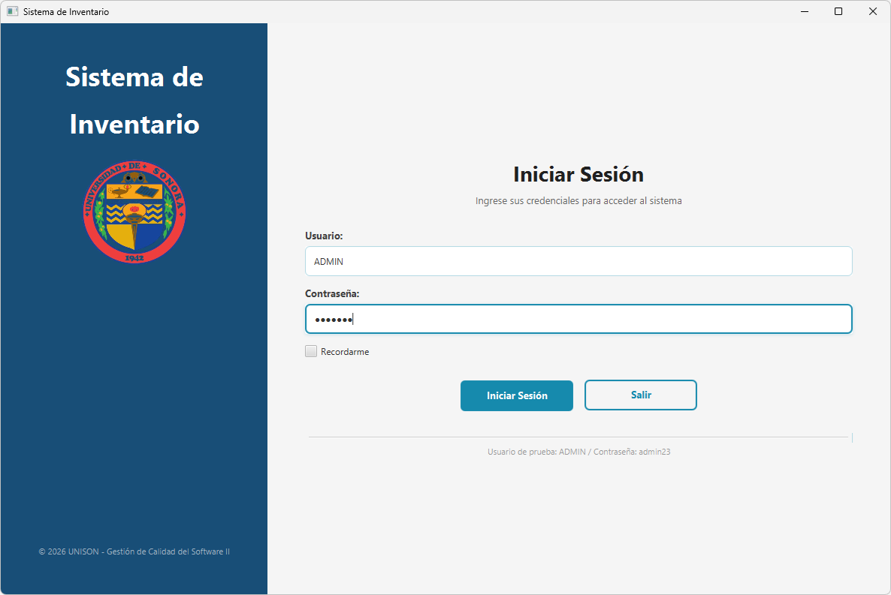
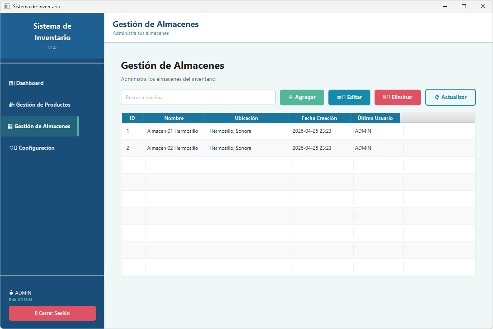

# Sistema Básico de Inventario

**Universidad de Sonora — Administración de Proyectos Informáticos II**

---

## Descripción

Sistema de escritorio para la gestión de inventario desarrollado en Java con JavaFX.
Permite administrar productos y almacenes mediante una interfaz gráfica con control de acceso
por roles. La base de datos se almacena localmente en un archivo SQLite (`Inventario.db`)
que se genera automáticamente al iniciar la aplicación.

---

## Tecnologías utilizadas

| Tecnología | Versión | Uso |
|---|---|---|
| Java | 21 | Lenguaje principal |
| JavaFX | 21 | Interfaz gráfica (FXML + CSS) |
| ORMLite | 6.1 | ORM para SQLite |
| SQLite JDBC | 3.45.1.0 | Controlador de base de datos |
| BCrypt | 0.10.2 | Encriptación de contraseñas |
| JUnit 5 | 5.12.2 | Pruebas unitarias e integración |
| Maven | 3.6+ | Gestión de dependencias y construcción |

---

## Arquitectura del proyecto

El proyecto sigue el patrón **MVC (Modelo-Vista-Controlador)** con una capa de persistencia
independiente implementada mediante el patrón **DAO** y **ORMLite**.

```
src/
├── main/
│   ├── java/mx/unison/
│   │   ├── Launcher.java                  ← Punto de entrada (evita restricciones de módulos JavaFX)
│   │   ├── Main.java                      ← Inicialización de JavaFX y base de datos
│   │   ├── models/                        ← Entidades del dominio
│   │   │   ├── Producto.java
│   │   │   ├── Almacen.java
│   │   │   └── Usuario.java
│   │   ├── database/                      ← Capa de persistencia
│   │   │   ├── DatabaseManager.java       ← Gestión centralizada de conexión y DAOs
│   │   │   └── dao/
│   │   │       ├── ProductoDao.java
│   │   │       ├── AlmacenDao.java
│   │   │       └── UsuarioDao.java
│   │   ├── controllers/                   ← Lógica de interfaz (MVC)
│   │   │   ├── MainController.java
│   │   │   ├── LoginController.java
│   │   │   ├── MainViewController.java
│   │   │   ├── ProductosViewController.java
│   │   │   ├── ProductoFormController.java
│   │   │   ├── AlmacenesViewController.java
│   │   │   ├── AlmacenFormController.java
│   │   │   └── ConfigViewController.java
│   │   ├── service/
│   │   │   └── AuthService.java           ← Lógica de autenticación
│   │   └── util/
│   │       ├── CryptoUtils.java           ← Hashing y verificación BCrypt
│   │       └── UIUtils.java               ← Helpers de alertas y UI
│   └── resources/
│       ├── views/                         ← Vistas FXML
│       │   ├── login.fxml
│       │   ├── main.fxml
│       │   ├── productos.fxml
│       │   ├── formProducto.fxml
│       │   ├── almacenes.fxml
│       │   └── formAlmacen.fxml
│       ├── styles/
│       │   ├── styles.css                 ← Estilos globales (colores UniSon)
│       │   └── navigation.css             ← Estilos de navegación
│       └── img/
│           └── escudo_unison.png
└── test/
    └── java/mx/unison/
        ├── models/                        ← Pruebas de modelos
        ├── database/dao/                  ← Pruebas de acceso a datos
        ├── service/                       ← Pruebas de autenticación
        ├── util/                          ← Pruebas de utilidades
        └── integration/                   ← Pruebas de flujo completo
```

---

## Instalación y ejecución

### Requisitos previos

- **Java 21** o superior — [Descargar JDK](https://adoptium.net/)
- **Maven 3.6** o superior — [Descargar Maven](https://maven.apache.org/download.cgi)

### Pasos

```bash
# 1. Clonar el repositorio
git clone https://github.com/pablo22a/sistema-inventario-javafx.git
cd sistema-inventario-javafx

# 2. Compilar el proyecto
mvn compile

# 3. Ejecutar la aplicación
mvn javafx:run
```

> **⚠️ Importante:** No ejecutes `Main.java` directamente desde el IDE.  
> Siempre usa `mvn javafx:run` o ejecuta la clase `Launcher.java`.

### Ejecución desde IntelliJ IDEA

1. Abre el proyecto con `File → Open`
2. IntelliJ detectará el proyecto Maven automáticamente
3. Configura el JDK 21 en `File → Project Structure → Project`
4. En el panel Maven (derecha): `Plugins → javafx → javafx:run` → doble clic

---

## Credenciales de acceso

| Usuario | Contraseña | Rol |
|---|---|---|
| ADMIN | admin23 | Administrador completo |
| PRODUCTOS | productos19 | Gestión de productos |
| ALMACENES | almacenes11 | Gestión de almacenes |

> Las contraseñas se almacenan en la base de datos usando **BCrypt** (salt + hash).  
> Nunca se guarda la contraseña en texto plano.

---

## Roles y permisos

| Funcionalidad | ADMIN | PRODUCTOS | ALMACENES |
|---|:---:|:---:|:---:|
| Ver productos | ✓ | ✓ | ✓ |
| Agregar / Modificar / Eliminar productos | ✓ | ✓ | — |
| Ver almacenes | ✓ | ✓ | ✓ |
| Agregar / Modificar / Eliminar almacenes | ✓ | — | ✓ |

---

## Estructura de la base de datos

La base de datos `Inventario.db` se crea automáticamente en el directorio de trabajo.

### Tabla `usuarios`
| Columna | Tipo | Descripción |
|---|---|---|
| id | INTEGER PK | Identificador auto-generado |
| nombre | TEXT | Nombre de usuario (único) |
| password | TEXT | Hash BCrypt de la contraseña |
| fecha_hora_ultimo_inicio | TEXT | Timestamp del último login |
| rol | TEXT | ADMIN / PRODUCTOS / ALMACENES |

### Tabla `almacenes`
| Columna | Tipo | Descripción |
|---|---|---|
| id | INTEGER PK | Identificador auto-generado |
| nombre | TEXT NOT NULL | Nombre del almacén |
| ubicacion | TEXT | Dirección o ubicación física |
| fechaHoraCreacion | TEXT | Timestamp de creación |
| fechaHoraUltimaMod | TEXT | Timestamp de última modificación |
| ultimoUsuario | TEXT | Usuario que realizó la última modificación |

### Tabla `productos`
| Columna | Tipo | Descripción |
|---|---|---|
| id | INTEGER PK | Identificador auto-generado |
| nombre | TEXT NOT NULL | Nombre del producto |
| descripcion | TEXT | Descripción detallada |
| cantidad | INTEGER | Stock disponible |
| precio | REAL | Precio unitario |
| almacen_id | INTEGER FK | Referencia al almacén |
| fechaCreacion | TEXT | Timestamp de creación |
| fechaModificacion | TEXT | Timestamp de última modificación |
| ultimoUsuario | TEXT | Usuario que realizó la última modificación |

---

## Pruebas

El proyecto cuenta con **68 casos de prueba** entre pruebas unitarias y de integración.

```bash
# Ejecutar todas las pruebas
mvn test
```

### Cobertura de pruebas

| Paquete | Clases de prueba |
|---|---|
| `models` | `ProductoTest`, `AlmacenTest`, `UsuarioTest` |
| `database` | `DatabaseManagerTest` |
| `database/dao` | `ProductoDaoTest`, `AlmacenDaoTest`, `UsuarioDaoTest` |
| `service` | `AuthServiceTest` |
| `util` | `CryptoUtilsTest`, `UIUtilsTest` |
| `integration` | `IntegracionAuthTest`, `IntegracionInventarioTest` |

---

## Documentación JavaDoc

La documentación generada en HTML se encuentra en `docs/javadoc/`.

```bash
# Regenerar JavaDoc
mvn javadoc:javadoc
```

---

## Capturas de pantalla

| Login | Dashboard |
|---|---|
|  |  |

| Gestión de Productos | Gestión de Almacenes |
|---|---|
|  |  |

---

## Notas de desarrollo

Este proyecto fue desarrollado en dos fases:

1. **Versión original (legacy/)** — Implementación inicial con Java Swing y consultas SQL directas.
2. **Versión refactorizada (src/)** — Migración completa a JavaFX, ORMLite, BCrypt, patrón MVC+DAO,
   pruebas unitarias y documentación Javadoc.

Los archivos originales se conservan en la carpeta `legacy/` para referencia histórica.
